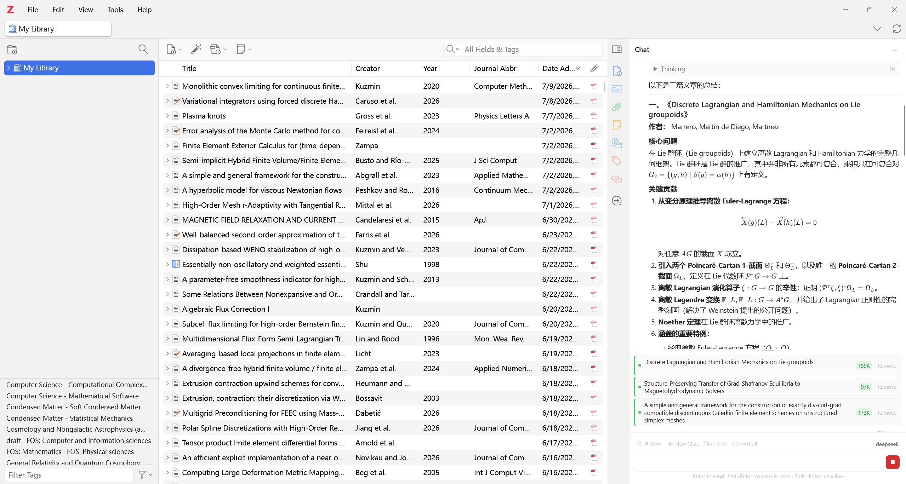

# ChatPDF for Zotero

[简体中文](README.zh-CN.md)

ChatPDF is a Zotero 7–9 add-on for reading and discussing research papers with an OpenAI-compatible language model. It adds a persistent chat panel to Zotero, converts PDFs through MinerU, and lets the assistant work with papers in your Zotero library.

## Project Scope

ChatPDF is developed primarily for personal use and is shared as-is. Zotero versions, operating systems, model providers, network/proxy setups, and individual research workflows vary, so the add-on may not work perfectly in every environment.

The source code is available for adaptation. You can use AI coding agents to help inspect errors and fine-tune ChatPDF for your own environment and workflow—for example, provider compatibility, interface behavior, conversion settings, or custom tools. Keep custom changes in version control, back up the cache, and test them with an isolated Zotero profile before using them with your daily library.

## Features

- Chat with one or more Zotero PDFs without leaving Zotero.
- Search your Zotero library and add relevant papers from the conversation.
- Convert long PDFs in resumable chunks and preserve extracted images locally.
- Stream answers with Markdown, LaTeX, reasoning, tool activity, and token usage.
- Keep separate chat sessions, source lists, and background work in each Zotero window.
- Optionally search and fetch public web pages.
- Save converted documents and chat history in a local cache.

## Requirements

- Zotero 7, 8, or 9.
- A MinerU API token for PDF conversion.
- An API key for an OpenAI-compatible chat-completions service.

## Installation

1. Download `chat-pdf.xpi` from [GitHub Releases](https://github.com/ruijie-xi/zotero-chat-pdf/releases).
2. In Zotero, open **Tools → Add-ons**.
3. Open the gear menu and select **Install Add-on From File…**.
4. Choose the downloaded XPI and restart Zotero.

Install a newer XPI the same way to upgrade. Your settings, converted documents, and chat history remain in the configured cache directory.

## Setup

Open **Edit → Settings → ChatPDF** on Windows/Linux or **Zotero → Settings → ChatPDF** on macOS.

At minimum, configure:

| Setting | Description |
| --- | --- |
| MinerU API Token | Used when a PDF needs to be converted. |
| LLM API Base URL | Base URL for an OpenAI-compatible API. |
| LLM API Key | Bearer token for the model provider. |
| Model Name | Model identifier accepted by the provider. |

The default API base and model target DeepSeek. You can save multiple model profiles and use **LLM API Test** to check the current endpoint and credentials.

Optional settings include MinerU language and timeout, thinking controls, agent iteration limit, context budget, cache directory, system prompt, debug-log level, and web tools. Brave Search is used when a Brave key is configured; otherwise web search falls back to DuckDuckGo.

## Quick Start

1. Add a paper by right-clicking a Zotero item and choosing **Add to ChatPDF**, or drag an item or reader tab into the panel.
2. Convert the PDF when its source chip shows that conversion is needed.
3. Enter a question and send it. The assistant can inspect document sections, search the Zotero library, and add or convert relevant papers when needed.

Keyboard shortcuts:

- **Enter**: send.
- **Shift+Enter**: insert a new line.
- **Ctrl+Enter**: convert pending selected sources, then send.

Mention one or more source chips in the editor to restrict a question to those papers. Without mentions, the assistant can use all sources in the current session. Use **Stop** to cancel an answer or an active conversion.

## Long PDFs

Large PDFs are converted in page ranges. Completed ranges are cached, so an interrupted conversion can continue without repeating finished work. The assistant can search the converted document and read only the relevant chunks instead of loading the whole paper into every request.

Conversion errors identify the failing stage: upload preparation, PDF upload, result polling, result download, or ZIP extraction. Retrying usually resumes from the last completed range.

## Web Tools

Web tools are disabled by default. When enabled, the assistant can search the public web and fetch readable text from HTTP(S) pages.

For safety, ChatPDF blocks embedded credentials, localhost, private/link-local networks, unsafe redirects, unsupported content types, timed-out requests, and oversized responses. A blocked request is reported as an error instead of returning partial content.

## Data and Privacy

The default cache directory is `~/.chatpdf-cache/`; you can change it in ChatPDF settings. It contains converted Markdown and assets, resumable conversion metadata, chat history, and optional debug logs.

- A PDF is sent to MinerU only when conversion is requested.
- Conversation messages, relevant document content, and tool results are sent to your configured LLM provider.
- Web queries and requested pages are sent to the selected search service and website only when web tools are enabled and used.
- Debug logging defaults to metadata only. **Full** logging can contain prompts, paper text, answers, reasoning, and tool results.
- API keys are stored in Zotero preferences. Do not include them in screenshots or bug reports.

## Troubleshooting

**The panel does not appear:** confirm that ChatPDF is enabled under **Tools → Add-ons**, then restart Zotero.

**The model request fails:** use **LLM API Test** and verify the base URL, key, model name, and provider compatibility.

**PDF conversion fails:** check the named conversion stage, MinerU token, network/proxy settings, and configured timeout, then retry.

**A source cannot be read:** confirm that it is converted and included in the current question's source mentions or session.

**Web search or fetch fails:** verify that web tools are enabled. Private/local targets and unsafe responses are intentionally blocked.

## Support

- [Report a problem](https://github.com/ruijie-xi/zotero-chat-pdf/issues)
- [Release notes](CHANGELOG.md) · [中文](CHANGELOG.zh-CN.md)
