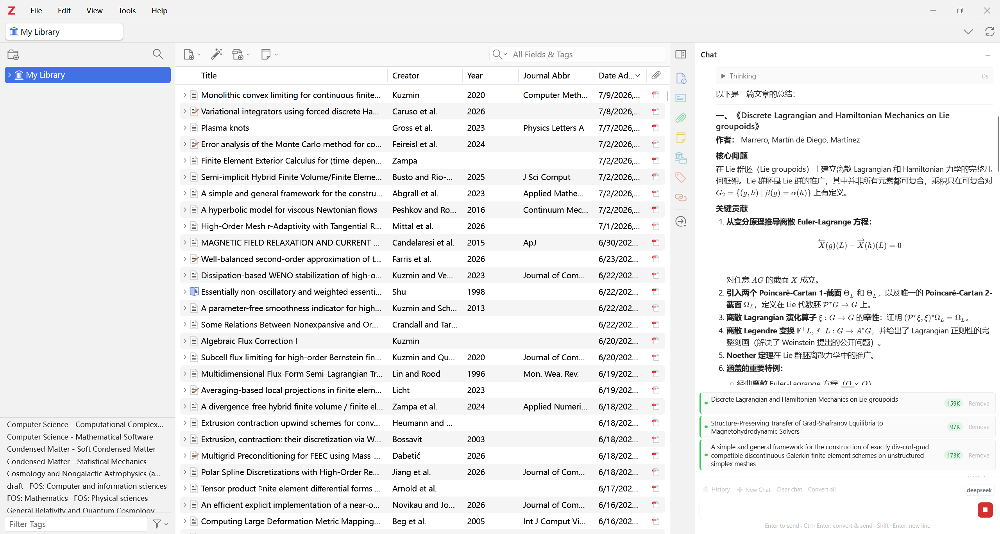

# ChatPDF for Zotero

[简体中文](README.zh-CN.md)

ChatPDF is a Zotero 7–10 add-on for reading and discussing research papers with an OpenAI-compatible language model. It adds a persistent chat panel to Zotero, converts PDFs through a vision model or MinerU, and lets the assistant work with papers in your Zotero library.

## Project Scope

ChatPDF is developed primarily for personal use and is shared as-is. Zotero versions, operating systems, model providers, network/proxy setups, and individual research workflows vary, so the add-on may not work perfectly in every environment.

The source code is available for adaptation. You can use AI coding agents to help inspect errors and fine-tune ChatPDF for your own environment and workflow—for example, provider compatibility, interface behavior, conversion settings, or custom tools. Keep custom changes in version control, back up the cache, and test them with an isolated Zotero profile before using them with your daily library.

## Agent capabilities update

The agent can search local text in unconverted PDFs, read page text or visual evidence, inspect document availability, and wait for an existing conversion. Search responses report inspected coverage and continuation cursors; unextractable or unavailable files remain explicit.

The chat window's library permission menu enables batch collection, subcollection, tag and bibliographic note changes, including deletion of empty collections. Moving all contents out and deleting the empty shell can share one batch; Undo restores the collection and memberships. Batch review is the default; reviews and completed receipts group readable changes with Undo. Child and standalone notes can be searched and read without PDF conversion. Source chips include a compact Process button and a right-click/More actions menu. The agent chooses tools and their order while the harness enforces scope, transactions and conflict detection. Stable system instructions/tool schemas and immutable provider history support context prefix reuse. See [Agent capabilities](docs/agent-capabilities.md).

## Features

- Chat with one or more Zotero PDFs without leaving Zotero.
- Search your Zotero library or remembered annotation text and add relevant papers from the conversation.
- Convert long PDFs in resumable chunks and preserve extracted images locally.
- Stream answers with Markdown, LaTeX, reasoning, tool activity, and token usage.
- Keep separate chat sessions, source lists, and background work in each Zotero window.
- Optionally search and fetch public web pages.
- Save converted documents and chat history in a local cache.
- Share the same converted Markdown with local MCP clients without creating a second index or cache.

## Requirements

- Zotero 7, 8, 9, or 10.0.
- A vision-capable OpenAI-compatible model for PDF conversion, or a MinerU API token when selecting MinerU.
- An API key for an OpenAI-compatible chat-completions service.

## Installation

1. Download `chat-pdf.xpi` from [GitHub Releases](https://github.com/ruijie-xi/zotero-chat-pdf/releases).
2. In Zotero, open **Tools → Add-ons**.
3. Open the gear menu and select **Install Add-on From File…**.
4. Choose the downloaded XPI and restart Zotero.

The first installation still uses the XPI file. Starting with the next release, Zotero can discover later ChatPDF versions through **Tools → Add-ons → Gear → Check for Updates…**, and can install them automatically when add-on updates are enabled. Your settings, converted documents, and chat history remain in the configured cache directory.

## Setup

Open **Edit → Settings → ChatPDF** on Windows/Linux or **Zotero → Settings → ChatPDF** on macOS.

At minimum, configure:

| Setting | Description |
| --- | --- |
| PDF conversion engine | Vision model (default), or MinerU. |
| Conversion model profile | Choose a saved vision profile or Use current chat model. Select another conversion profile before deleting a referenced profile. |
| MinerU API Token | Required only when selecting MinerU. |
| LLM Provider | DeepSeek, OpenCode Go, or Custom (the existing OpenAI-compatible configuration). |
| LLM API Base URL | Base URL for an OpenAI-compatible API. |
| LLM API Key | Bearer token for the model provider. |
| Model Name | Model identifier accepted by the provider. |

The default API base and model target DeepSeek; existing settings and profiles remain **Custom**. Built-in providers fill in their endpoint and a default model. Provider selection is saved with each model profile. Switching providers keeps separate drafts while the settings pane is open and does not carry credentials or token overrides to a new provider. Save profiles to retain those configurations across restarts. Use **LLM API Test** to check the current endpoint and credentials.

**OpenCode Go** uses `https://opencode.ai/zen/go/v1` and a Go API key. Suggested DeepSeek IDs include `deepseek-v4.1-flash`, `deepseek-v4-pro`, and `deepseek-v4-flash`, without the `opencode-go/` prefix. ChatPDF sends its own client identity and a stable conversation header on main and auxiliary requests. Local token counts use the explicit DeepSeek V4 estimate. Known Go DeepSeek models use bundled catalogue capacities when `/models` omits them; endpoint metadata and manual overrides take precedence. Unknown models require explicit limits. [Go is intended for coding agents](https://opencode.ai/docs/go/#where-can-i-use-it); this integration does not guarantee service acceptance for paper-reading traffic.

Optional settings include PDF pages per request, concurrency, render DPI, page-image caching, request timeout, MinerU language and timeout, thinking controls, agent iteration limit, context budget, cache directory, system prompt, debug-log level, and web tools. Brave Search is used when a Brave key is configured; otherwise web search falls back to DuckDuckGo.

Preferences group models, PDF conversion and chat behavior separately, with advanced settings collapsed. Only the selected conversion engine's fields are shown. Current fields take effect immediately; named profiles and the system prompt have explicit save controls. Conversion profiles use their saved fields independently of current chat edits.

History searches chat and associated paper titles, supports durable pins and an empty-chat filter, and shows 50 entries at a time with a Show more control. Source summaries display request counts, additional requests, retry reasons and reported tokens. Retry reuses validated saved work where available; Reconvert starts recognition again and may incur model charges.

## Quick Start

1. Add a paper by right-clicking a Zotero item and choosing **Add to ChatPDF**, or drag an item or reader tab into the panel.
2. Convert the PDF when its source chip shows that conversion is needed.
3. Enter a question and send it. The assistant can inspect document sections, search the Zotero library, and add or convert relevant papers when needed.

Keyboard shortcuts:

- **Enter**: send.
- **Shift+Enter**: insert a new line.
- **Ctrl+Enter**: convert pending selected sources, then send.

Mention one or more source chips in the editor to restrict a question to those papers. Without mentions, the assistant can use all sources in the current session. Use **Stop** to cancel an answer or an active conversion.

## Long PDFs

Large PDFs are converted in page ranges. Completed ranges are cached, so an interrupted conversion can continue without repeating finished work. The assistant can search the converted document and read only the relevant chunks instead of loading the whole paper into every request.

Vision conversion renders pages with Zotero's bundled PDF.js, sends page images to the selected model, and caches validated Markdown and optional page images. Defaults are four pages per request, two concurrent requests, 150 DPI, and a 180-second request timeout. No external PDF renderer is required. Page markers, text/symbol coverage and KaTeX syntax checks reject incomplete output; failed ranges are split and retried with validation feedback. These checks cannot prove mathematical transcription accuracy.

**Retry** continues compatible saved chunks. **Reconvert** starts fresh with the selected engine; the previous cache remains intact until the replacement passes validation. Existing MinerU caches remain readable. MinerU retains its upload/poll/download/extraction stages. See [PDF conversion details](docs/pdf-vision-conversion.md).

By default, the conversion model appends a short structured self-check in the same response. The plugin applies only exact local edits and revalidates the result; no separate review request or second full transcription is sent. The `Self-check X/Y` badge records the checked page count. This is model self-checking, not independent verification; use **Reconvert** to apply it to an older cache.

Click **View conversion process** under a PDF source to inspect validated-page progress, elapsed time, parallel chunks, requests, reported token usage, the page images sent to the model, and Markdown with exact self-check corrections. Live drafts use the original streaming response and remain labeled unvalidated until checks pass. Viewing the panel makes no model request. Disable **Live conversion preview** in settings if your endpoint rejects streaming. A failed cache write can retry a complete, digest-verified checkpoint without rendering or model calls.

## Local MCP Integration

When ChatPDF is running, it registers one exact-protocol loopback endpoint at `POST /chatpdf/v1` on Zotero's local server. A local MCP server can discover the cache and Zotero library mapping, read the current Zotero selection, start/list/poll/cancel conversions, and recover known job IDs after an agent restart. The MCP server reads `document.md`, chunks, manifests, and extracted assets directly from the same cache used by the panel.

Conversion requests from the panel and MCP are deduplicated by `libraryID:attachmentKey`. Each panel window and the bridge owns an independent lease, so one panel cannot cancel work still used elsewhere; explicit MCP cancellation remains job-wide. MCP callers may choose `options.engine` (`vision` or `mineru`), or MinerU pipeline/VLM, language, OCR, formula/table extraction, and a bounded MinerU polling timeout for each job. One atomic conversion registry records safe checkpoints, chunk progress, timestamps, and errors without storing tokens or signed upload URLs. Active work resumes after Zotero restarts when a checkpoint is safe; otherwise the job becomes explicitly `interrupted` and retryable.

A ready cache hit also enriches a legacy manifest with canonical document, Zotero library, attachment, and parent-paper identity. This does not contact MinerU or alter the cached Markdown, and it lets later cache-only reads preserve those associations while Zotero is temporarily unavailable.

New output is written to per-job staging and replaces the canonical document directory only after the complete Markdown, manifest, chunks, and assets are ready. A failed or forced reconversion therefore leaves an older ready document readable. Local cancellation stops ChatPDF work and records whether the already accepted remote MinerU task may continue. MinerU tokens remain in Zotero preferences and are never included in bridge responses. The bridge uses Zotero's loopback server and is not a public remote API.

## Web Tools

Web tools are disabled by default. When enabled, the assistant can search the public web and fetch readable text from HTTP(S) pages.

For safety, ChatPDF blocks embedded credentials, localhost, private/link-local networks, unsafe redirects, unsupported content types, timed-out requests, and oversized responses. A blocked request is reported as an error instead of returning partial content.

## Data and Privacy

The default cache directory is `~/.chatpdf-cache/`; you can change it in ChatPDF settings. It contains converted Markdown and assets, resumable conversion metadata, chat history, and optional debug logs.

- PDF conversion sends rendered page images to the selected vision provider, or PDF bytes to MinerU when that engine is selected. Conversion starts only when requested; startup can resume previously requested active work.
- Conversation messages, relevant document content, and tool results are sent to your configured LLM provider.
- Web queries and requested pages are sent to the selected search service and website only when web tools are enabled and used.
- Debug logging defaults to metadata only. **Full** logging can contain prompts, paper text, answers, reasoning, and tool results.
- API keys are stored in Zotero preferences. Do not include them in screenshots or bug reports.

## Troubleshooting

**The panel does not appear:** confirm that ChatPDF is enabled under **Tools → Add-ons**, then restart Zotero.

**The model request fails:** use **LLM API Test** and verify the base URL, key, model name, and provider compatibility.

**PDF conversion fails:** check the named stage, selected engine, conversion model's image support and token budgets, API key, network/proxy settings, and timeout. Retry continues saved chunks; use Reconvert after changing the source PDF or conversion model. MinerU requires its own token.

**A source cannot be read:** confirm that it is converted and included in the current question's source mentions or session.

**Web search or fetch fails:** verify that web tools are enabled. Private/local targets and unsafe responses are intentionally blocked.

## Support

- [Report a problem](https://github.com/ruijie-xi/zotero-chat-pdf/issues)
- [Release notes](CHANGELOG.md)
