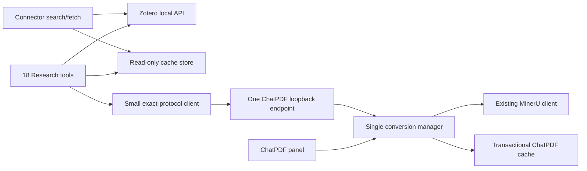

# Function-Preserving ChatPDF and Zotero MCP Simplification Plan

Date: 2026-07-27

Repositories:

- ChatPDF: `D:\Myfiles\Codes\claude-projects\pdf-chat`
- Zotero MCP: `D:\Myfiles\Codes\zotero-mcp`

Reference revisions observed while preparing this plan:

- ChatPDF baseline: `76b1df3` (`v0.8.7`, `main`)
- Zotero MCP baseline: `f9956ce` (`main`)

## 1. Objective

Preserve the complete current user-visible feature set while substantially reducing implementation complexity, especially in the ChatPDF conversion orchestration and the cross-repository bridge.

The simplification target is implementation surface, not tool surface:

- ChatPDF remains a self-contained Zotero plugin and works normally when MCP is absent or stopped.
- The Research toolset keeps all 18 current tools.
- The Connector toolset keeps both current tools.
- Conversion start, progress, history, restart recovery, cancellation, force reconversion, per-job MinerU options, current Zotero selection, and cache integrity remain available.
- ChatPDF and Zotero MCP use one exact bridge protocol with no old-protocol compatibility code.
- The ChatPDF production diff from `76b1df3` is minimized without deleting behavior merely to meet a line target.

## 2. Non-Negotiable Principles

1. ChatPDF core conversion, cache, and chat behavior must never depend on MCP being installed, configured, or running.
2. ChatPDF core must not import the bridge. The bridge may call a narrow public ChatPDF conversion API.
3. Preserve all current public MCP tool names, parameters, result models, and documented semantics unless a concrete defect requires a separately approved contract change.
4. Use one authoritative conversion state machine. The UI, bridge, journal, and MCP client must not independently interpret or mutate conversion state.
5. Use one exact bridge protocol. Delete capability negotiation, legacy route support, alternate request shapes, DELETE fallback, and compatibility exceptions.
6. Existing released ChatPDF cache data remains readable. Cache compatibility is user-data compatibility, not bridge-protocol compatibility.
7. ChatPDF remains the only owner of PDF path resolution, MinerU credentials, MinerU execution, staging, and final cache writes.
8. Zotero MCP remains read-only toward Zotero records. It must not read `zotero.sqlite`, accept arbitrary local paths, store MinerU credentials, create a second search index, or write converted documents.
9. Every runtime MCP acceptance case must use a brand-new agent session and actual native MCP tool calls. Terminal, Python, repository inspection, HTTP probes, and mocks do not count as runtime acceptance.
10. Do not stage, commit, push, tag, publish, or release either repository unless separately requested.

## 3. Feature-Parity Contract

### 3.1 ChatPDF standalone features to preserve

- Panel startup, source chips, chat, session persistence, and cached-document reads.
- PDF conversion through the panel with ChatPDF preferences and MinerU credentials.
- Global deduplication by `libraryID:attachmentKey` so UI and MCP cannot start duplicate work.
- Partial long-PDF chunk reuse.
- Assets, Markdown, chunks, and manifests written as one coherent document.
- Atomic replacement of an older ready document only after the new document is complete.
- Recovery of an interrupted conversion after Zotero restarts, including resumable MinerU batch metadata where available.
- Conversion progress, retained history, cancellation, and sanitized errors.
- Force reconversion and per-job MinerU options exposed by the current MCP tool.
- Plugin startup and shutdown even when bridge registration or journal recovery encounters an error.

### 3.2 Research toolset to preserve exactly

1. `zotero_search`
2. `zotero_search_annotations`
3. `zotero_get_item`
4. `zotero_get_current_selection`
5. `zotero_status`
6. `zotero_list_collections`
7. `zotero_list_collection_items`
8. `document_list`
9. `document_read`
10. `document_list_chunks`
11. `document_read_chunk`
12. `document_search`
13. `document_list_assets`
14. `document_read_asset`
15. `document_start_conversion`
16. `document_conversion_status`
17. `document_list_conversions`
18. `document_cancel_conversion`

Explicit annotation search, current selection, status, document listing, chunk listing/reading, conversion listing, and conversion cancellation are real features. They must not be folded into other tools merely to reduce the tool count.

### 3.3 Connector toolset to preserve exactly

1. `search`
2. `fetch`

Research and Connector are loaded and accepted independently.

### 3.4 Meaning of “no old-version compatibility”

Remove compatibility only at the bridge protocol boundary:

- no old endpoint paths;
- no capability probing;
- no legacy capability names;
- no DELETE-to-POST fallback;
- no alternate field names or legacy response models;
- no migration for the current uncommitted conversion-journal prototype.

Retain support for already released ChatPDF cache layouts needed to read user data, including v2 documents. The simplified writer may continue to emit the current enriched manifest format.

## 4. Target Architecture



The bridge exists only for live Zotero/plugin state that cannot be obtained from the local Zotero API or final cache:

- bridge and library status;
- current Zotero selection;
- conversion start, get, list, and cancel.

Metadata, annotations, collections, cached Markdown, chunks, search, and assets remain direct MCP-side reads. They must not be routed through ChatPDF.

## 5. One Exact Bridge Protocol

### 5.1 Transport

Register one Zotero loopback endpoint:

```text
POST /chatpdf/v1
Content-Type: application/json
```

Every request uses this envelope:

```json
{
  "protocol_version": 1,
  "op": "status",
  "params": {}
}
```

Supported operations:

1. `status`
2. `selection.get`
3. `conversion.start`
4. `conversion.get`
5. `conversion.list`
6. `conversion.cancel`

Every successful response uses:

```json
{
  "protocol_version": 1,
  "ok": true,
  "result": {}
}
```

Every expected application error uses:

```json
{
  "protocol_version": 1,
  "ok": false,
  "error": {
    "code": "invalid_item",
    "message": "A sanitized public message",
    "retryable": false
  }
}
```

Malformed envelopes may return HTTP 400. Unexpected handler failures may return HTTP 500 with a fixed sanitized message. Expected domain failures remain typed envelope results so the Python client has one parsing path.

### 5.2 Operation payloads

`status` returns the plugin version, manifest version, internally consumed cache directory, and public-to-internal library mapping. `zotero_status` must not expose the cache path.

`selection.get` returns the same selection model currently exposed by `zotero_get_current_selection`.

`conversion.start` accepts the current complete contract:

```json
{
  "item_id": "user:123:ABCD1234",
  "force": false,
  "options": {
    "model_version": "pipeline",
    "language": "ch",
    "is_ocr": false,
    "enable_formula": true,
    "enable_table": true,
    "mineru_poll_timeout_seconds": 900
  }
}
```

`conversion.get` and `conversion.cancel` accept `job_id`. `conversion.list` accepts the current optional state filter. List pagination remains MCP-side because the retained journal is locally bounded.

All conversion operations return the current `ConversionStatus` fields. `conversion.list` returns the current conversion-list model.

### 5.3 Protocol rules

- Validate `protocol_version == 1` on every request.
- Do not return a capability list for negotiation. MCP knows the fixed protocol contract.
- Keep HTTP/1.1, serialized access, `trust_env=False`, bounded timeouts, and sanitized transport errors in the MCP client.
- Never return a MinerU token or PDF path.
- Return the cache directory only to the internal status client; redact it from public MCP results and acceptance logs.
- Register and unregister only one Zotero endpoint class.

## 6. Single ChatPDF Conversion Manager

Replace the current split between `document-conversion-service.ts` and `conversion-storage.ts` with one cohesive manager plus narrow cache primitives.

### 6.1 Public API

The manager should expose only the calls needed by UI lifecycle and bridge code:

- `initialize()`
- `start(request, owner)`
- `get(jobId)`
- `list(state?)`
- `cancel(jobId)`
- `subscribe(jobId, listener)`
- `release(jobId, owner)`
- `suspendAll()`
- `requestFromSource(source)`

Do not expose storage functions, mutable job objects, MinerU task objects, or cache transaction details.

### 6.2 One state model

Keep the current public states:

```text
pending | converting | recovering | ready | error | cancelled | interrupted | unknown
```

Internally, one job record owns:

- identity and normalized request;
- public status snapshot;
- one `AbortController` and one completion promise;
- owner IDs and subscribers;
- completed chunk indexes;
- resumable MinerU task IDs/states;
- staging directory identity;
- durable timestamps.

The bridge serializes snapshots. It must not calculate states, infer retryability, or edit jobs.

### 6.3 Ownership and cancellation

- `start` deduplicates by cache key and joins the existing promise.
- Each panel/window and the bridge receives an explicit owner ID.
- Removing a source releases only that window's ownership.
- Releasing one owner never aborts work still owned by another UI window or MCP.
- When the last ordinary owner leaves, the manager may abort the job according to existing panel behavior.
- `document_cancel_conversion` is an explicit job-level cancellation and aborts the shared job for all owners.
- Subscription removal never implies cancellation.

This removes the current ambiguity where one UI abort can cancel a globally shared UI/MCP job.

### 6.4 Durable journal without a second state machine

Use one bounded, atomically written registry such as:

```text
<cacheDir>/conversions/jobs.json
<cacheDir>/conversions/staging/<jobId>/
```

Rules:

- One serialized persistence queue writes the registry.
- Persist only durable transitions: creation, remote task changes, completed chunks, terminal state, and shutdown suspension.
- Do not persist every display-only progress message.
- Retain the current bounded history semantics.
- Parse and validate each job independently. Skip and log one corrupt entry without preventing ChatPDF startup or loading valid jobs.
- Recovery re-enters the same `run(job, recovering)` path used by a new job.
- The current uncommitted per-job journal layout has no migration path and may be deleted during implementation.

### 6.5 Transactional cache commit

Move filesystem transaction mechanics behind narrow `md-cache.ts` operations:

- create/clean a job staging document directory;
- copy reusable chunks and their referenced assets into staging;
- write staged Markdown, chunks, assets, and manifest;
- validate that the staged document is internally complete;
- atomically replace the canonical document while preserving/restoring the old ready document on failure;
- recover an interrupted swap during startup.

The manager decides when to commit; `md-cache.ts` decides how. Normal reads should resolve the canonical directory only after startup repair, rather than searching arbitrary backup directories on every read.

This explicitly fixes the current risk that reused chunk Markdown can be committed without its old assets.

### 6.6 MinerU client boundary

Keep `mineru-client.ts` focused on one conversion attempt:

- accept normalized per-job options;
- report progress and chunk completion;
- report resumable remote task state;
- resume polling an already uploaded MinerU batch;
- write extraction output only to the supplied staging directory;
- honor abort signals.

It must not know about job history, bridge payloads, UI owners, canonical cache swaps, or journal retention.

## 7. Repository Change Plan and Budgets

Line budgets are design pressure, not permission to remove behavior. Any exception must identify the preserved feature or Zotero runtime constraint that requires it.

### 7.1 ChatPDF

Expected production changes relative to `76b1df3`:

- `src/hooks.ts`: isolated manager initialization and one bridge registration/unregistration path.
- `src/modules/source-chips.ts`: thin UI adapter using manager ownership/subscription APIs.
- `src/modules/md-cache.ts`: narrow staging, validation, commit, and startup-repair primitives.
- `src/modules/mineru-client.ts`: only per-job options and resumable-task callbacks.
- `src/modules/conversion-manager.ts`: the single job/state/journal orchestrator.
- `src/modules/chatpdf-bridge.ts`: one endpoint, validation, item resolution, and serialization.

Remove the current prototypes after their responsibilities are absorbed:

- `src/modules/conversion-storage.ts`
- `src/modules/document-conversion-service.ts`

Targets:

- no new dependency and no new user preference;
- bridge at or below approximately 200 lines;
- conversion manager at or below approximately 500 lines;
- combined production-code addition at or below approximately 850 lines;
- only the six production modules listed above differ for this feature;
- no duplicate status sanitizer, option normalizer, job parser, or cache-key resolver.

The current prototype is approximately 1,211 new production lines across the three new modules before counting changes to existing modules. The target should therefore represent a material reduction, not a file rename or mechanical merge.

Unrelated documentation, policy, or user work already present in the dirty tree must remain separate and must not be silently restored, staged, or included in implementation commits.

### 7.2 Zotero MCP

The MCP repository may be rewritten aggressively internally while preserving its public tools:

- replace `bridge.py` with one generic exact-protocol request path and six small typed wrappers;
- remove `BridgeIncompatible`, capability negotiation, DELETE handling, POST fallback, alternate paths, and legacy response branches;
- keep the current Pydantic tool result models and all 18 Research schemas;
- preserve `document_list_conversions` filtering and pagination at the MCP layer;
- make `zotero_status` report the fixed protocol contract without probing optional capabilities;
- keep cache discovery, path containment, output completeness, paging, HTTP/1.1, serialized requests, and `trust_env=False`;
- keep Connector registration independently limited to `search` and `fetch`.

Targets:

- `bridge.py` at or below approximately 150 lines;
- no compatibility-only model or exception;
- no tool removal, aliasing, or parameter reduction;
- no second cache index or copied Markdown;
- no changes to direct cache-reading behavior unless required to preserve v2/v3 data compatibility or fix a verified defect.

## 8. Implementation Phases

### Phase 0 — Freeze evidence and parity

1. Record both repository revisions, dirty-tree state, diff statistics, and current test baselines.
2. Export the current 18 Research and 2 Connector tool schemas as the parity fixture.
3. Add a feature matrix mapping every public tool to Zotero API, direct cache, or one bridge operation.
4. Freeze the one-endpoint protocol request/response examples.
5. Do not use `git reset`, `git checkout --`, or bulk restoration against the dirty ChatPDF tree.

Exit gate: every current public feature has an explicit owner and acceptance case; no feature is marked for removal.

### Phase 1 — Add tests around current behavior

Before simplifying, add or retain focused tests for:

- all 18 Research tool names and schemas;
- both Connector tool names;
- conversion option forwarding and force behavior;
- selection and status sanitization;
- start deduplication and ready-cache hits;
- list filtering/history retention;
- explicit cancellation;
- UI owner release without cross-cancellation;
- restart recovery and corrupt-journal isolation;
- reused chunk assets in a staged commit;
- rollback/startup repair after interrupted replacement;
- bridge registration failure not blocking ChatPDF startup.

Exit gate: tests capture the behavior that the refactor must preserve, including the four previously identified risk areas.

### Phase 2 — Consolidate ChatPDF conversion ownership

1. Introduce the single conversion manager and owner model.
2. Move journal logic into the manager using one atomic registry and strict per-entry validation.
3. Move cache transaction mechanics into narrow `md-cache.ts` functions.
4. Keep MinerU callbacks purely conversion-oriented.
5. Convert `source-chips.ts` to the manager API.
6. Remove the two prototype service/storage modules only after equivalent tests pass.

Exit gate: standalone panel conversion, deduplication, cancellation, history, recovery, and atomic cache behavior all pass without a bridge registered.

### Phase 3 — Replace the ChatPDF bridge

1. Implement the single `POST /chatpdf/v1` endpoint and six operations.
2. Keep item/attachment resolution and wire serialization local to the bridge.
3. Call only the manager's public API.
4. Register/unregister the one endpoint inside isolated lifecycle error handling.
5. Delete all old route constants, endpoint classes, capability lists, and fallback behavior.

Exit gate: contract tests cover every operation and prove that responses contain no token or PDF path.

### Phase 4 — Rewrite the MCP bridge client

1. Implement one serialized POST request method with exact protocol validation.
2. Add six minimal typed wrappers used by the unchanged public MCP tools.
3. Remove all capability checks and HTTP method fallbacks.
4. Keep public error/result models and tool schemas unchanged.
5. Update both READMEs, changelog, doctor/status text, and tests to describe only protocol v1.

Exit gate: the full 18+2 schema parity fixture matches, and no old bridge route or capability name remains.

### Phase 5 — Deterministic local verification

These checks are preflight only and do not replace real MCP acceptance.

ChatPDF:

```powershell
npm.cmd run verify
git diff --check
git diff --stat 76b1df3
```

Also inspect the production XPI to confirm the expected modules are bundled and removed prototype modules are absent.

Zotero MCP:

```powershell
.venv\Scripts\python.exe -m ruff check .
.venv\Scripts\python.exe -m pytest
```

Also search both repositories for removed endpoint paths, capability negotiation, `BridgeIncompatible`, DELETE fallback, and duplicate state enums.

### Phase 6 — Standalone ChatPDF acceptance

Run with MCP stopped and no MCP client connected:

1. Start Zotero with the rebuilt plugin.
2. Open the panel and read an already cached PDF.
3. Convert a small uncached PDF through the panel and chat with it.
4. Start the same PDF from two windows and confirm one conversion is shared.
5. Remove the source from one window and confirm the remaining owner continues.
6. Cancel a UI-only conversion and confirm the source returns to its expected pending state.
7. Restart Zotero during a dedicated conversion and confirm recovery/history behavior.
8. Force a bridge registration failure and confirm panel startup and ordinary chat still work.
9. Confirm a failed force reconversion leaves the previous ready document readable.

This phase is mandatory proof that ChatPDF is self-contained.

## 9. Fresh-Agent MCP Acceptance

### 9.1 Harness rules

- Launch a new agent process/session for every case.
- Never use resume, continue, a previous thread ID, or prior conversation history.
- Use the normal Codex configuration that exposes the intended Zotero MCP toolset.
- Run cases serially because Zotero bridge requests are serialized.
- A fresh case may receive a sanitized fixture ID or prior job ID as prompt data; it may not inherit another session's conversation.
- A case passes only when the transcript contains the expected native MCP tool call and a matching result.
- Terminal, shell, Python, repository inspection, direct HTTP, or simulated output causes runtime acceptance failure.
- If the requested toolset is not exposed in the fresh session, report `MCP not loaded in current session`; do not substitute another test method.

Store ignored evidence under the MCP repository, for example:

- `tests/agent_acceptance/cases.json`
- `scripts/run_agent_acceptance.py`
- `agent-acceptance-output/<run-id>/`

Retain for each case:

- case ID and exact prompt;
- unique agent session ID;
- toolset expected and toolset actually exposed;
- native MCP calls, sanitized arguments, and results;
- final agent response;
- elapsed time;
- machine-readable PASS/FAIL reason.

### 9.2 Standard prompt envelope

```text
This is Zotero MCP acceptance case <CASE_ID>. Use only native Zotero MCP tools for Zotero and ChatPDF data. Do not use a terminal, shell, filesystem inspection, repository code, Python, web search, direct HTTP, or simulated results. Complete only this case. Return one JSON object with keys case_id, passed, tools_called, evidence, and error.
```

### 9.3 Research cases: one fresh session per target tool

| Case | Required target tool | Primary assertion |
| --- | --- | --- |
| R01 | `zotero_search` | Finds a known metadata/annotation/document phrase and returns the related bibliographic item ID. |
| R02 | `zotero_search_annotations` | Applies annotation-specific filters and identifies the related paper. |
| R03 | `zotero_get_item` | Returns bibliographic metadata, attachments, readiness, and canonical document identity. |
| R04 | `zotero_get_current_selection` | Returns the actual selected item or open reader item. |
| R05 | `zotero_status` | Reports sanitized Zotero, bridge, cache, protocol, and MCP status without paths or secrets. |
| R06 | `zotero_list_collections` | Lists a known fixture collection. |
| R07 | `zotero_list_collection_items` | Lists the expected items in that collection. |
| R08 | `document_list` | Lists a known cached document with canonical ID. |
| R09 | `document_read` | Reads complete known Markdown or the requested explicit range. |
| R10 | `document_list_chunks` | Returns contiguous 1-based chunks and matching totals. |
| R11 | `document_read_chunk` | Reads every fixture chunk and proves ordered concatenation equals `document_read`. |
| R12 | `document_search` | Returns matching context from a known cached phrase. |
| R13 | `document_list_assets` | Lists only contained assets for an asset-bearing fixture. |
| R14 | `document_read_asset` | Reads one listed text/image asset through the native tool. |
| R15 | `document_start_conversion` | Starts one uncached fixture with force/options as configured and returns a non-empty job ID. |
| R16 | `document_conversion_status` | Polls the supplied job ID to a valid state and reads the document when ready. |
| R17 | `document_list_conversions` | Finds retained/current jobs and verifies state filtering/paging. |
| R18 | `document_cancel_conversion` | Cancels a dedicated active fixture and returns the expected sanitized terminal status. |

Prerequisite calls inside a case are allowed, but the named target tool and its assertion are mandatory. R15-R18 use dedicated fixtures so cancellation and force conversion never affect user documents.

### 9.4 Connector cases

Run with Connector independently loaded:

| Case | Required target tool | Primary assertion |
| --- | --- | --- |
| C01 | `search` | Returns deduplicated Zotero/ChatPDF results in the Connector contract. |
| C02 | `fetch` | Fetches one ID returned by Connector search. |

Failure to load Connector does not invalidate a separately passing Research run, and vice versa.

### 9.5 Resilience cases

Each also uses a new agent session:

- N01: with the bridge unavailable, a known cached `document_read` still succeeds.
- N02: with the bridge unavailable, `document_start_conversion` returns the expected structured unavailable result.
- N03: after Zotero restarts during a dedicated conversion, `document_list_conversions` or `document_conversion_status` observes the recovered/terminal job.
- N04: no prompt, transcript, status output, or error contains a MinerU token, PDF path, cache path, or remote upload URL.

## 10. Final Acceptance Gates

### ChatPDF

- Works normally with MCP stopped.
- `npm.cmd run verify` passes and the production XPI builds.
- The implementation preserves conversion options, force, progress, history, restart recovery, cancellation, deduplication, chunk reuse, assets, and atomic old-document protection.
- One corrupt journal entry cannot prevent plugin startup or recovery of valid jobs.
- Reused chunks retain all referenced assets after staging and commit.
- One UI owner cannot accidentally cancel another UI or MCP owner.
- Bridge registration failure cannot block panel startup.
- Only one conversion manager and one bridge endpoint exist.
- The ChatPDF feature diff meets the production file/line targets or documents a concrete justified exception.

### Zotero MCP

- `ruff check .` and `pytest` pass.
- Research exposes exactly the same 18 tools and schemas captured in Phase 0.
- Connector exposes exactly `search` and `fetch`.
- All conversion options and all selection/status/history/cancellation features remain callable.
- Only protocol version 1 is implemented; no compatibility or fallback branch remains.
- Cache reads remain contained, complete, canonical, and independent of bridge availability.
- No direct Zotero database read, arbitrary file read, cache write, credential handling, duplicate index, or Markdown copy is introduced.

### Runtime agent acceptance

- R01-R18, C01-C02, and N01-N04 each used a unique fresh agent session.
- Every passing case contains actual native MCP tool-call evidence.
- Research and Connector loading are reported separately.
- Ordered chunk concatenation equals the complete document, ranges are contiguous and 1-based, and character totals match.
- No terminal, repository, Python, HTTP, mock, or simulated result is counted as MCP runtime evidence.

## 11. Expected Result

The final system has the same external capabilities as the current implementation, but a much smaller coordination surface:

- one ChatPDF conversion manager instead of service/storage/UI state overlap;
- one bridge endpoint instead of five routes and method fallbacks;
- one exact protocol instead of capability negotiation;
- one Python request path instead of route-specific compatibility logic;
- all 18 Research tools and both Connector tools preserved;
- direct cache reads remain fast and independent;
- ChatPDF remains fully usable by itself.

No functional reduction is accepted as a shortcut for code reduction.

## 12. Execution Result (2026-07-27)

Implementation and release-readiness verification are complete.

- ChatPDF keeps the standalone panel and all conversion behavior behind one manager and one exact bridge endpoint.
- The final ChatPDF production delta from `76b1df3` is 1,170 added and 324 deleted lines, or 846 net lines. The bridge
  is 207 lines and the manager is 601 lines. The manager exceeds its approximate per-file target because it retains
  owner isolation, durable history, restart recovery, per-job MinerU options, sanitization, and transactional commit;
  the combined production delta remains inside the approximately 850-line budget.
- Two additional existing ChatPDF modules (`tools.ts` and `zotero-items.ts`) changed to remove a duplicate Zotero
  selection implementation shared by the panel bridge and agent tools.
- Zotero MCP production code is 65 net lines smaller than `f9956ce`; `bridge.py` is 160 lines. All 18 Research and
  both Connector tools remain present.
- A fresh-agent R10 failure found that chunk listings lacked a document character total. The release code now returns
  `total_lines`, `character_count`, and `chunk_count`, and the new R10 session proved that the seven chunk counts sum
  to the 477,779-character document total.
- Fresh-agent native-MCP acceptance passed R01-R18, C01-C02, and N01-N04 in 24 unique cases. Exact prompts and full
  native tool transcripts remain in their task threads; the machine-readable index is stored at
  `D:\Myfiles\Codes\zotero-mcp\agent-acceptance-output\2026-07-27-release-readiness\report.json` and is ignored by Git.
- ChatPDF passed type checking, lint, 73 tests, production XPI build, and an npm audit with zero vulnerabilities.
- Zotero MCP passed Ruff, 64 tests under pytest 9.1.1, wheel/sdist builds, `pip check`, and `pip-audit` with zero known
  vulnerabilities. The pytest minimum was raised to 9.0.3 after the audit identified an affected older test version.
- The installed XPI used for live acceptance and the final XPI have the same business-bundle SHA-256. The final bundle
  contains only `/chatpdf/v1`, contains the protocol envelope, and contains neither old bridge route.
- With zero `zotero-mcp.exe` processes, a restarted Zotero instance loaded ChatPDF 0.8.7 and answered the exact v1
  status request successfully. The panel was also observed loaded in the real Zotero reader. Background Windows UI
  restrictions prevented a reliable automated right-click/source-add interaction, so that visual gesture is not
  claimed as automated evidence; owner, cached-read, conversion, cancellation, and recovery behavior is covered by
  unit tests and native runtime cases.

No files were staged or committed, and no tag, push, package upload, or release was performed.
